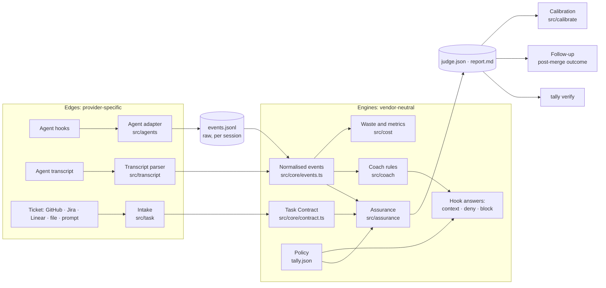

# Architecture

Tally is a local CLI plus a hook script. A coding agent (Claude Code, Codex CLI, Gemini CLI, Cursor) calls the hook on its lifecycle events; Tally records what happened, freezes what was asked, and later proves what it can about the result. Nothing runs as a service. Everything lives under `~/.tally`.

## The two boundaries

**Agent boundary** (`src/agents/index.ts`). Each adapter maps an agent's hook events and payloads onto one vocabulary (Claude Code's, because Codex adopted it and the others differ only in names), normalises tool names (`run_shell_command`, `shell` → `Bash`; `apply_patch`, `replace` → `Edit`), and shapes Tally's answers back into the agent's dialect (permission denial, additional context, a Stop block or Cursor's follow-up message). Adapters declare capabilities; what an agent does not expose is reported as unknown, never estimated. `docs/ADAPTER_SDK.md` is the contract.

**Model boundary** (`src/llm/`). The Judge, Coach and intake talk to a model through one interface: `claude -p` on the user's login by default, or any OpenAI-compatible endpoint. The judging model is independent of the agent's model.

## Data model

| File | Written by | Read by |
|---|---|---|
| `sessions/<id>/events.jsonl` | the hook, one line per agent event, redacted and truncated | everything |
| `sessions/<id>/task.json` | intake | Judge, Coach, `tally task` |
| `sessions/<id>/contract.json` | intake, `task --confirm`, `task --edit` | `tally task --show` |
| `sessions/<id>/judge.json`, `report.md` | the Judge, including the Evidence Map (`assurance`) | `tally verify`, reports, calibration, follow-up |
| `sessions/<id>/progress.json`, `coach-*.json`, `inject.jsonl` | quick checks and the Coach | status line, MCP server, hooks |
| `history.jsonl` | finalize and the Judge | reports, export, onboarding |
| `calibration.jsonl` | blind grading, disputes | `tally calibrate report` |
| `config.json`, `pricing.json`, `backups/` | install and config | everything |

Raw events are kept in the agent-facing vocabulary for compatibility; `src/core/events.ts` projects them, together with the transcript, into the normalised stream (`session_started`, `user_prompt`, `file_edit`, `command_finished`, `test_finished`, `model_usage`, …) with `agent` and `model` as separate identities and a `source` pointer back to the raw line. Engines consume the stream; they do not know which agent produced it.

## The Judge in one paragraph

Tier 0 resolves every criterion that has a mechanical check (a file exists, a diff matches, the independent test run passed) with no model. Tier 1 asks a small model about the rest with a trimmed evidence pack. Tier 2 asks a stronger model only where a criterion could flip the verdict, the small model was unsure, or its quality score was pessimistic. A maintainer-review pass reads the diff for layer, blast radius and untested surface on library-shaped repos and can only hold a verdict down. The Assurance Engine then re-expresses the receipt as an Evidence Map: deterministic items first, a model's reading labelled `interpreted`, and one of VERIFIED / SUPPORTED / UNVERIFIED / UNMET per criterion. `tally verify` prints that map.

## Invariants

- Hooks finish in under 150 ms, make no network calls, and exit 0. Heavy work runs detached.
- A model's judgment can raise a criterion no higher than SUPPORTED on its own and can never override a deterministic negative.
- Cost, tokens and model names appear only when the agent exposed them.
- Tests are re-run only after one consent per repo, in a scrubbed environment, with a timeout, never against a reconstructed tree.
- Stored data is forward-compatible: new fields are optional, old receipts load and re-score.
- Nothing is written into the user's repository except what the user asked for (`tally playbook --write`, `HANDOFF.md` by the Coach in `auto` mode).

## Where to add things

| You want to | Start in |
|---|---|
| Support another agent | `src/agents/index.ts` (one adapter object), `docs/ADAPTER_SDK.md` |
| Read another transcript format for cost | `src/transcript/` and the dispatch in `parseTranscriptFile` |
| Add a mechanical check | `src/judge/checks.ts` (`CheckSpecSchema`, `resolveCheck`) and `src/judge/quickcheck.ts` for the live ticks |
| Add an evidence kind or change a status rule | `src/assurance/index.ts` (`buildAssurance`) and `test/h16-assurance.test.ts` |
| Add a Coach rule | `src/coach/rules/`, register in `rules/index.ts`, test in `test/m5-coach-rules.test.ts` |
| Add a policy | `src/policy.ts`, enforce in the hook or the Judge, document in README |
| Add a fixture to the eval | `test/fixtures/calibration/<name>/` (`task.json`, `repo.json`, `expected.json`), then `tally calibrate eval --live --record --only <name>` |
