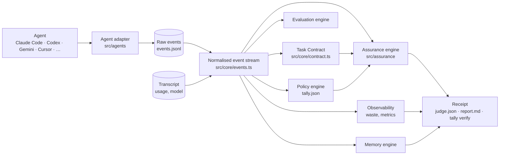

# Tally as the reliability layer for AI coding agents

Status: living document. Written 2026-09-27 against 0.4.0 after an audit of the whole repository (30 source modules, 196 tests, five authored fixtures, two blind-graded evals). This is the plan for turning Tally from "receipts and a coach for Claude Code" into a vendor-neutral engine that answers five questions about any coding agent's work:

1. **VERIFY**: did the agent complete the requested task?
2. **OBSERVE**: how did it behave while doing so?
3. **REMEMBER**: what should future agents know about this repository?
4. **COMPARE**: which agent, model or configuration works best for this workload?
5. **GOVERN**: what rules must be satisfied before work counts as complete?

The governing principle: **evidence is the source of truth; model judgment fills gaps and is labelled as such.** A claim on a receipt must trace to a file, a diff hunk, a command result, a transcript event or git state. Where none exists, the honest answer is UNVERIFIED.

## What exists today (audit)

| Concern | Where it lives | Reusable as is | Notes |
|---|---|---|---|
| Raw agent events | `src/store/events.ts`: `events.jsonl` per session, types `session_start`, `prompt`, `pre_tool`, `post_tool`, `stop`, `session_end`, `ship`, `task`, `inject`, `dod_gate`, `hard_stop_denied`, `permission`, `note` | yes, as the raw store | Vocabulary is Claude Code's hook vocabulary; other agents are normalised into it at the edge (`src/agents/`) |
| Agent adapters | `src/agents/index.ts`: Claude Code, Codex CLI, Gemini CLI, Cursor; event map, payload normalisation, output shaping, hook-file install | yes | Needs an explicit capabilities declaration and a documented contract |
| Transcripts and cost | `src/transcript/parse.ts` (Claude Code), `src/transcript/codex.ts` (Codex rollouts), `src/cost/pricing.ts` | yes | Gemini and Cursor expose no usage; cost is already reported as unavailable, not estimated |
| Task intake | `src/task/intake.ts`: `task.json` with frozen criteria (id, text, source, mechanical check), spec quality, questions, estimate, confirmed/inferred flags | yes | Already a frozen contract in all but name; lacks constraints, verification commands, revision history and a status |
| Judge | `src/judge/judge.ts`, `checks.ts`, `tiers.ts`, `review.ts`: tier 0 mechanical checks, tier 1 small model, tier 2 strong model, maintainer review; statuses met/partial/unmet/unverifiable with cited evidence, files and the resolving tier | yes | Statuses conflate "proved" with "a model said so"; the evidence is a sentence, not a map |
| Independent verification | `src/judge/verify.ts`: detects or takes the policy `test_command`, runs it in a scrubbed environment with a timeout after one consent per repo | yes | Does not yet distinguish pre-existing tests from tests the agent wrote |
| Receipts | `src/judge/schema.ts`, `report.ts`: `judge.json` + `report.md` | yes, extend | Verdict, quality 0–10 and ROI lead the summary; they should follow the evidence |
| Coach | `src/coach/`: 15 deterministic rules, LLM pass, autopilot, flags | yes | Rule inputs are raw events; they will read the normalised stream once it exists |
| Policy | `src/policy.ts`: `tally.json` criteria, budget, hard stop, `test_command` | yes, extend | |
| Follow-up | `src/commands/followup.ts` | yes | Post-merge outcome tracking already distinguishes "looked done" from "held up" |
| Calibration | `src/calibrate/`: fixtures replayed in CI, blind grading, agreement reports | yes | Needs the new statuses and a false-VERIFIED measure |
| Backfill, experiments, export, replay, onboard, playbook | `src/backfill/`, `src/commands/*` | yes | |

Backwards-compatibility requirements found: stored `events.jsonl`, `task.json`, `judge.json`, `history.jsonl` and `calibration.jsonl` must keep loading; the plugin's hook command line (`node dist/hook.js <Event>`) must keep working; `tally calibrate rescore` must be able to re-derive receipts from stored criteria.

## Target architecture

Provider-specific code stays in `src/agents/` and `src/transcript/`. Nothing under `src/core/`, `src/assurance/` or the engines may branch on the agent's identity; they read `NormalizedEvent` and a `TaskContract`.

The migration is incremental: the raw store is unchanged, the normalised stream is **derived** from it, and each engine is moved onto the stream when it is touched. Existing receipts stay readable; new fields are optional.

## Vocabulary

| Term | Meaning |
|---|---|
| Task Contract | The frozen definition of done: goal, acceptance criteria, constraints, verification commands, unknowns, status (`needs_confirmation`, `confirmed`), and every revision |
| Evidence item | One traceable fact: a changed file, a diff hunk, a test added, an independent run, a command result, a transcript event, a git ref, or a model judgment (always labelled `interpreted`) |
| Evidence Map | Per criterion, the evidence items and the status they support |
| VERIFIED | Deterministic evidence directly demonstrates the criterion (an independent run, a file check, a diff match), or the model's judgment is backed by at least one deterministic item that names the same work |
| SUPPORTED | Evidence supports the criterion but needs interpretation or is incomplete (a model judgment without a deterministic anchor; visible partial work) |
| UNVERIFIED | Not enough evidence to say |
| UNMET | Evidence shows the criterion was not done |
| Provenance | Whether a test existed at session start, was written by the agent, or was run independently by Tally |

The four statuses map onto the stored `met / partial / unmet / unverifiable` plus the resolving tier, so old receipts can be re-expressed without re-judging.

## Releases

Sequencing follows what the repository can support today, not a wish list.

### v0.5 Assurance (shipped 2026-09-27)

- `src/core/events.ts`: the normalised event model with `agent` and `model` as separate objects, derived from the raw store and the transcript. Tests prove the projection on the fixture session and on Codex, Gemini and Cursor payloads.
- `src/core/contract.ts`: Task Contract as a first-class object projected from `task.json` (goal, criteria, constraints, verification, unknowns, status, revisions). `tally task --show` renders it; `--confirm` and `--edit` record revisions.
- `src/assurance/`: the Evidence Map and the four statuses, built from deterministic evidence first and the Judge's model judgments second; test provenance (pre-existing / agent-created / independent).
- `tally verify [--json] [--ci] [--deep]`: the flagship output. `--json` follows a documented `tally.verify.v1` schema. `--ci` exits non-zero on UNMET.
- Receipt redesign: evidence first, agent and model named, verification provenance, potentially avoidable work itemised, verdict and ROI labelled experimental and moved down.
- Adapter capabilities and `tally adapters`.
- Docs: this roadmap, `ARCHITECTURE.md`, `ADAPTER_SDK.md`, `EVALUATION.md`, a README that leads with the five questions.

### v0.6 Evaluation (shipped 2026-09-27)

Pulled forward: before adding more assurance features, the project needed a way to find out when the existing ones over-claim.

- `tally eval run|discover|report`: isolated repository, coding-agent session with Tally attached, Tally's judge, a blind evaluator in a separate process, comparison, a committed ledger by class (`eval/results/`).
- Five adversarial calibration fixtures with `assurance_ceiling`; false VERIFIED counted and gated in CI; `--rebaseline` for honest lower numbers.
- Deterministic safeguards the evaluation forced: a runner that runs nothing is inconclusive and caps the verdict; a test claim needs a test; a touched test file is provenance, not an anchor; a tree is scanned only if it holds the receipt's base commit; generic tokens are not names.
- `scripts/release-check.mjs`: the release checklist as an executable.

### v0.7 Ship quality

- `tally ship`: evidence-based readiness (contract, criteria, tests, lint, scope, regression evidence, documentation, policy) with blocking and weak evidence listed and next actions.
- Scope expansion: expected areas from the contract versus areas touched, flagged not judged.
- `tally risk`: touched modules, callers where practical, tests that cover them, suggested verification commands.
- Test-quality evidence for new or changed tests (exercises changed behaviour, meaningful assertions, negative cases), static first, model only where static cannot tell.
- Plan drift where an agent exposes a plan (Claude Code's TodoWrite, Cursor's plan events).
- Policy expansion in `tally.json`: `requirements`, `paths.require_human_review`, generated-file protection, verification required before ship. Deterministic enforcement only.

### v0.8 Memory

- Repository memory under `.tally/memory/` with provenance (source, supporting sessions, confidence, first and last observed); explainable with `tally memory` and `tally memory explain <id>`.
- Mistake memory: recurring failure patterns across sessions, surfaced as historical warnings at session start, agent-agnostic.
- Instruction-file recommendations (CLAUDE.md, AGENTS.md, tool equivalents) proposed from repeated evidence, never auto-applied unless configured.

### v0.9 Ecosystem

- Adapter SDK declared stable-ish; adapters for OpenCode and Aider where their hooks or logs allow; Copilot where technically possible.
- Comparison infrastructure over the receipt store: agent product, model, provider, agent version, policy, repository, task type; always with sample sizes.

### v1.0 Deep assurance

- Mutation verification in an isolated worktree (`tally verify --deep` gains mutations; opt-in; never touches the user's tree).
- Richer regression analysis; mature evaluation suite with false-VERIFIED as the headline error.

### Beyond

The reliability layer: an agent is replaceable, Tally retains the truth.

## Non-goals for now

SaaS dashboards, billing, team accounts, web UI, deeper Jira, enterprise SSO, every coding agent, universal benchmarks, more ROI math.

## Measuring progress

Every release updates `docs/EVALUATION.md` with sample sizes, exact agreement, supported/unverified confusion, false VERIFIED, false UNMET and abstention rate, on the authored fixtures, the headless task set and the real-issue set, plus whatever human-graded sessions exist. False VERIFIED is the number the project treats as a bug.
